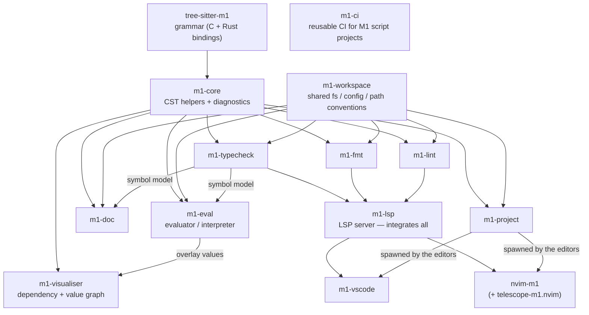

# M1 Toolchain

A suite of developer tools for the MoTeC M1 scripting language (`.m1scr`):
syntax highlighting, a language server, formatting, linting, type checking,
project-file editing, and CI — across all major editors.

## Getting started

Most people want one of these, no checkout required:

- **VS Code** — install the [m1-vscode](https://github.com/nedlane/m1-vscode)
  extension; it bundles everything.
- **Neovim** — install [nvim-m1](https://github.com/C-Nucifora/nvim-m1); it
  downloads the pinned toolchain on install.
- **CI** — reference the reusable
  [m1-ci](https://github.com/C-Nucifora/m1-ci) workflow from your M1 project.
- **Command line** — grab prebuilt binaries from each tool's Releases page;
  see [docs/cli.md](docs/cli.md) for a per-tool quickstart.

To work on the toolchain itself, this repo is the
[vcstool](https://github.com/dirk-thomas/vcstool) manifest that checks every
repo out as a sibling:

```sh
pip install vcstool
git clone https://github.com/C-Nucifora/m1-tools.git
cd m1-tools
vcs import .. < m1-tools.repos     # clone all sub-repos as siblings
vcs pull .. < m1-tools.repos       # later: update them all to latest main
```

The manifest tracks every repo at **`main`** — the right default for working
*on* the toolchain, but not what consumers run: CI and the pre-commit hooks
install the frozen versions pinned in
[m1-ci/tools.env](https://github.com/C-Nucifora/m1-ci/blob/main/tools.env).
To reproduce that published toolchain instead (e.g. to chase a "passes
locally, fails in CI" mismatch), generate a tag-pinned manifest on demand:

```sh
scripts/release-manifest.sh > m1-tools-release.repos
mkdir released && cd released
vcs import .. < ../m1-tools-release.repos
```

(The four CLI tools resolve to the `tools.env` pins; everything else to its
latest release. Generated, not committed, so it cannot go stale in-tree.)

## The tools

| Repo | Purpose |
| --- | --- |
| [tree-sitter-m1](https://github.com/C-Nucifora/tree-sitter-m1) | Tree-sitter grammar + Rust bindings |
| [m1-core](https://github.com/C-Nucifora/m1-core) | CST access, syntax diagnostics, `@m1:` annotations |
| [m1-workspace](https://github.com/nedlane/m1-workspace) | Shared discovery / decoding / config conventions |
| [m1-fmt](https://github.com/C-Nucifora/m1-fmt) | Code formatter |
| [m1-lint](https://github.com/C-Nucifora/m1-lint) | Static analysis / linter (`m1-lint --rules` for the catalogue) |
| [m1-typecheck](https://github.com/C-Nucifora/m1-typecheck) | Symbol model + type diagnostics (`--rules` for the catalogue) |
| [m1-doc](https://github.com/C-Nucifora/m1-doc) | Documentation generator: Markdown/HTML reference from a project |
| [m1-eval](https://github.com/C-Nucifora/m1-eval) | Script evaluator/interpreter: real numeric evaluation, whole-project scheduling, counterfactual log replay |
| [m1-visualiser](https://github.com/C-Nucifora/m1-visualiser) | Interactive dependency & lookup-table graph (self-contained Cytoscape HTML + DOT/JSON) |
| [m1-project](https://github.com/nedlane/m1-project) | Validated CLI editor for `Project.m1prj` |
| [m1-lsp](https://github.com/C-Nucifora/m1-lsp) | Language server integrating the above |
| [m1-vscode](https://github.com/nedlane/m1-vscode) | VS Code extension |
| [nvim-m1](https://github.com/C-Nucifora/nvim-m1) | Neovim plugin (LSP + tree-sitter + lint + fmt) |
| [telescope-m1.nvim](https://github.com/C-Nucifora/telescope-m1.nvim) | Telescope pickers: symbols, components, rules |
| [m1-ci](https://github.com/C-Nucifora/m1-ci) | Reusable GitHub Actions workflows + pre-commit hooks |

Each repo's README covers its own features; this repo is the map.

## Architecture



The layers above are: **tree-sitter-m1** (grammar) → **m1-core** /
**m1-workspace** (shared libraries) → the **domain libraries / CLIs**
(m1-typecheck, m1-fmt, m1-lint, m1-project, m1-doc, m1-eval) → **m1-lsp** (the
language server that integrates them) → the **editor clients** (m1-vscode,
nvim-m1). **m1-visualiser** graphs the dependency / lookup-table structure and
can overlay m1-eval's computed values. **m1-ci** is standalone: reusable CI for
M1 *script* projects, not a build-time dependency of the toolchain.

Repos depend on each other via **versioned git tags** (none are on
crates.io), so every repo builds from a standalone clone; consumer-bump PRs
propagate each upstream release down the graph. The defaults across the
toolchain follow the M1 Development Manual (tab indentation, Allman braces,
its naming/layout rules); teams that diverge configure it, the manual stays
the default.

## Configuration

All the tools and editors read one workspace-level **`m1-tools.toml`** at the
project root (`m1-lsp --scaffold-config` writes a starter). Precedence is
lowest-first and differs between the CLIs and the editors:

**CLI tools** (`m1-fmt`, `m1-lint`, `m1-typecheck`, …):

1. built-in defaults (the M1 manual's style),
2. `m1-tools.toml` — `[format]`, `[lint]`, `[diagnostics]` sections,
3. tool-specific files (`.m1fmt.toml`, `.m1lint.toml`),
4. CLI flags.

**Editors** (VS Code / Neovim via `m1-lsp`):

1. built-in defaults,
2. editor settings (VS Code `m1.*` settings / nvim-m1 `settings`),
3. the workspace `m1-tools.toml` — a committed project config deliberately
   wins over personal editor settings, so a team's style is what everyone's
   editor enforces.

See [docs/cli.md](docs/cli.md#configuration--precedence) for the details and
shared CLI conventions (exit codes, output formats).

## Editor setup

`m1-lsp` serves not just `.m1scr` scripts but the project file
`Project.m1prj` too — channel/parameter rename from a `<Component>`
declaration and document links from the project to its backing scripts.
Register the `.m1prj` extension with `m1-lsp` (as its own XML-ish
language/mode — don't reuse the `.m1scr` grammar) to get these features, not
just script-file diagnostics. The snippets below do this; the Neovim plugin
does it by default via `attach_m1prj`.

### VS Code

Install [m1-vscode](https://github.com/nedlane/m1-vscode) from its Releases
page (`code --install-extension m1-vscode-<platform>.vsix`). It bundles the
language server — no separate installs.

### Neovim

```lua
-- lazy.nvim
{
  "C-Nucifora/nvim-m1",
  dependencies = {
    "C-Nucifora/tree-sitter-m1", -- the m1 grammar + queries (required)
    { "nvim-treesitter/nvim-treesitter", optional = true },
    { "neovim/nvim-lspconfig", optional = true }, -- only needed on Neovim 0.10
    { "stevearc/conform.nvim", optional = true },
    { "mfussenegger/nvim-lint", optional = true },
  },
  build = function()
    require("nvim-m1.install").install() -- downloads the pinned toolchain
  end,
  ft = { "m1scr", "m1prj" },
  opts = {},
}
```

Run `:checkhealth nvim-m1` to verify. Add
[telescope-m1.nvim](https://github.com/C-Nucifora/telescope-m1.nvim) for
symbol/component/rule pickers. Each tool also ships a standalone Neovim
plugin (documented in its repo) if you want just one piece; `nvim-m1` is the
supported way to combine them.

### Zed

Add to `settings.json`:

```json
{
  "lsp": {
    "m1-lsp": {
      "binary": { "path": "/path/to/m1-lsp" }
    }
  },
  "languages": {
    "M1 Script": { "language_servers": ["m1-lsp"] },
    "M1 Project": { "language_servers": ["m1-lsp"] }
  }
}
```

`"M1 Project"` is the `.m1prj` language (XML-ish, no `m1scr` grammar) and
gives you `Project.m1prj` rename + document links. Grammar support for
scripts requires registering `tree-sitter-m1` per the
[Zed extension guide](https://zed.dev/docs/extensions/languages).

### Helix

Add to `~/.config/helix/languages.toml`:

```toml
[[language]]
name             = "m1scr"
scope            = "source.m1scr"
file-types       = ["m1scr"]
roots            = ["Project.m1prj"]
language-servers = ["m1-lsp"]
formatter        = { command = "m1-fmt" }

# Serve Project.m1prj too (channel/parameter rename + document links).
# Its own language — no source.m1scr grammar scope, no m1-fmt formatter.
[[language]]
name             = "m1prj"
file-types       = ["m1prj"]
roots            = ["Project.m1prj"]
language-servers = ["m1-lsp"]

[language-server.m1-lsp]
command = "/path/to/m1-lsp"
```

Place the grammar under `~/.config/helix/runtime/grammars/` per Helix's
[adding languages guide](https://docs.helix-editor.com/guides/adding_languages.html).

### Emacs (eglot)

```elisp
(add-to-list 'auto-mode-alist '("\\.m1scr\\'" . prog-mode))
;; Serve Project.m1prj too (rename + document links). It's XML, so use
;; nxml-mode rather than the script grammar/prog-mode.
(add-to-list 'auto-mode-alist '("\\.m1prj\\'" . nxml-mode))
(with-eval-after-load 'eglot
  (add-to-list 'eglot-server-programs
               '((prog-mode nxml-mode) . ("/path/to/m1-lsp"))))
(dolist (hook '(prog-mode-hook nxml-mode-hook))
  (add-hook hook
    (lambda ()
      (when (member (file-name-extension (or buffer-file-name ""))
                    '("m1scr" "m1prj"))
        (eglot-ensure)))))
```

## Continuous integration

Reference the [m1-ci](https://github.com/C-Nucifora/m1-ci) reusable workflow
(pin a release tag, not `@main`) to run `m1-fmt --check`, `m1-lint`,
`m1-typecheck`, and `m1-project validate` with pinned tool versions, inline
PR annotations, and optional SARIF upload:

```yaml
# .github/workflows/check.yml
jobs:
  m1-check:
    uses: C-Nucifora/m1-ci/.github/workflows/check.yml@v0.24.0
```

The same gates run locally as pre-commit hooks at the same pinned versions —
see the [m1-ci README](https://github.com/C-Nucifora/m1-ci). (CI on this repo
checks that the tag above is the latest m1-ci release.)

## Building from source

All Rust tools build with stable Rust (`cargo build --release`); prebuilt
binaries are attached to each tool's Releases. `tree-sitter-m1` additionally
needs Node.js for grammar regeneration. The Neovim plugins are installed via
your plugin manager, not built.

## License

Licensed under the GNU General Public License v3.0 or later
(GPL-3.0-or-later) — see [LICENSE](LICENSE).

Copyright (C) 2026 The M1 Tools authors.
